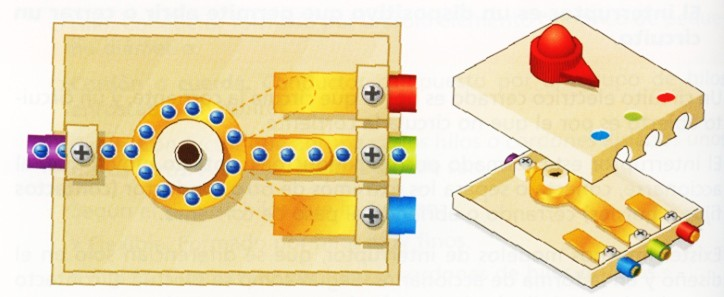
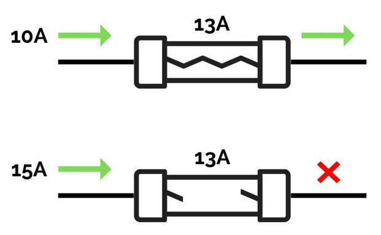
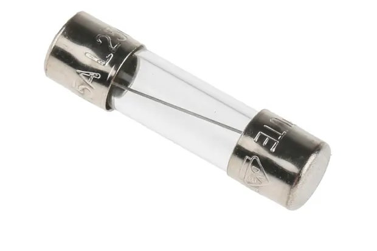

# 4.1. Componentes eléctricos

{ align=right width=40% }

Como vimos en el apartado anterior el circuito eléctrico está formado por un conjunto de **componentes eléctricos** conectados entre sí formando un camino cerrado. Estos componentes los podemos clasificar en:

1. Generadores eléctricos
2. Receptores eléctricos
3. Conductores eléctricos
4. Elementos de control o maniobra
5. Elementos de protección

## 4.1.1. Generadores eléctricos

!!! info "Definición de **generador eléctrico**"
    Los **generadores** son los componentes eléctricos que producen o generan la corriente eléctrica.

{ align=right width=250px }

Para ello, mantienen una fuerza (**voltaje**) constante entre dos puntos denominados bornes o polos (positivo y negativo), moviendo los electrones desde el polo negativo al positivo.

Ejemplos de generadores son! las pilas de los dispositivos eléctricos, las baterías de los coches, los alternadores de las centrales eléctricas o las dinamos de las bicicletas.

## 4.1.2. Conductores eléctricos

!!! info "Definición de **conductor eléctrico**"
    Los **conductores** son los componentes eléctricos que sirven para conectar los demás componentes y para que circulen por ellos los electrones (la corriente eléctrica).

{ align=right width=300px }

Son los cables o láminas metálicas que unen el generador con los receptores y demás componentes eléctricos. Por ellos circula la corriente eléctrica. Los conductores se conectan entre sí con distintos tipos de conectores.

En los hilos y cables se utiliza el **cobre** por sus propiedades: es *dúctil* (puede estirarse en hilos sin romperse) y excelente *conductor de la electricidad*. Además, están recubiertos de plástico porque este material es aislante y permite manipular los cables eléctricos sin riesgo de recibir descargas.

## 4.1.3. Receptores eléctricos

!!! info "Definición de **receptor eléctrico**"
    Los **receptores** son los componentes eléctricos a los que les llega la energía eléctrica y la transforma en otro tipo de energía útil (luminosa, cinética, sonora...). 

Son los dispositivos que transforman la energía asociada a la corriente eléctrica en otras formas de energía. Son ejemplos: las bombillas, los motores, las resistencias, etc.

- Una **bombilla** recibe **energía eléctrica** y la transforma en **energía luminosa** .
- Un motor eléctrico recibe **energía eléctrica** y la transforma en **energía cinética**.
- Una zumbador recibe **energía eléctrica** y la transforma en **energía sonora**.

**¡Recuerda!,** un circuito eléctrico no sirve para nada sin un receptor como mínimo.

Los receptores más importantes son: la lámpara y el motor eléctrico, aunque hay más, como: el timbre, el zumbador, una resistencia...

### Lámparas (o bombillas)

> Las **lámparas** (o bombillas) transforman la *energía eléctrica* que les llega en *energía luminosa (radiante)*.

{ align=right width=200px }

Las bombillas transforman en luz la corriente eléctrica que se les suministra, El problema es que sólo un 15 o un 25 % de esta corriente se convierte en luz, el resto se disipa (pierde) en forma de calor.

Sinos fijamos con cuidado, vemos que la parte que se ilumina es un conductor muy fino! el filamento.

Al estrecharse el conductor, los electrones chocan más a menudo con los átomos del filamento, por lo que éste se calienta a más de 3.000 ºC. A esas temperaturas, la mayoría de los metales se funden, por eso se utiliza el tungsteno, que es un material con un punto de fusión de 3.200 ºC.

### Motores eléctricos

> Los **motores** transforman la energía eléctrica en energía cinética (movimiento).

{ align=right width=200px }

Se utilizan en muchísimos aparatos: lavadoras, batidoras, taladrados, ventiladores, etc.

Al abrir un motor se observa que contiene una bobina, que es un conductor fino enrollado con muchas vueltas, y unos imanes. Básicamente, el funcionamiento de un motor es el siguiente: al pasar la electricidad por la bobina, ésta se comporta como un imán y es atraído por el imán fijo que la hace girar.

### Zumbadores

{ align=right width=200px }

> Un **zumbador** eléctrico es un dispositivo que transforma la energía eléctrica en energía sonora.

Emite un sonido característico (zumbido) cuando se le aplica una corriente eléctrica. Es ampliamente utilizado en circuitos y dispositivos electrónicos para generar señales audibles que sirven como alarmas, indicadores o avisos.

## 4.1.4. Elementos de maniobra o de control

!!! info "Definición de **elemento de control**"
    Los **elementos de maniobra** sirven para conectar y desconectar el circuito a nuestra voluntad o dirigir la corriente por distintas ramas del circuito.

{ align=right width=300px }

Los más importantes son:

- el interruptor,
- el pulsador,
- el conmutador.

### Interruptores

{ align=right width=250px }

> Un **interruptor** es un componente eléctrico cuya función es abrir o cerrar un circuito de forma permanente.

Al accionarlo haremos que varíe su posición, abriendo un circuito que estaba cerrado o cerrando uno que estaba abierto, permaneciendo así hasta que lo volvamos a accionar.

### Pulsadores

> Un **pulsador** es un componente eléctrico que, cuando se oprime, permite el paso de la corriente eléctrica y, cuando se deja de oprimir, lo interrumpe.

Se emplea en los timbres, las máquinas expendedoras de refrescos, los teclados de los ordenadores, para seleccionar el piso en los ascensores y en otras muchas aplicaciones.

Existen dos tipos de pulsadores:

{ align=right width=250px }

* **pulsador N.A.** (**N**ormalmente **A**bierto): los contactos del pulsador están abiertos; es decir, no dejan pasar la corriente hasta que pulsamos. Son los más comunes.

* **pulsador N.C.** (**N**ormalmente **C**errado): los contactos del pulsador están cerrados, es decir, dejan pasar la corriente hasta que pulsamos.

### Conmutadores
{ align=right width=100px }

> Un **conmutador** es un interruptor que abre un circuito, al mismo tiempo que, automáticamente, cierra otro.

Es decir, el conmutador es un doble interruptor porque actúa sobre dos circuitos, abriendo uno y cerrando el otro, o viceversa.

{ align=right width=250px }

Al conmutador llegan más de dos cables en vez de sólo dos, por lo que la diferencia entre un interruptor normal y un conmutador consiste en que el primero tiene dos contactos y el segundo tiene tres o más.

## 4.1.5. Elementos de protección

!!! info "Definición de **elementos de protección**"
    Son elementos que protegen a los usuarios o a otros componentes cuando hay subidas inesperadas de tensión. 

### Fusibles

{ align=right width=150px }

{ align=right width=150px }

El funcionamiento de los fusibles es muy sencillo. Por ejemplo, si el aparato seamos proteger no puede soportar una intensidad mayor de 13 A intercalamos en el circuito un fusible que se funda a esa intensidad. Si aumenta la intensidad por encima de ese valor, el fusible se calienta tanto que se funde, interrumpiendo así el paso de la corriente eléctrica. De esta forma, el fusible se funde protegiendo el aparato. Sólo tendremos que cambiar el fusible para que de nuevo el circuito vuelva a funcionar.

### Interruptor magnetotérmico

{ align=right width=200px }

Un magnetotérmico es un dispositivo que encontramos en los cuadros eléctricos de las casas y que sirve para protegernos a nosotros y a los aparatos eléctricos.
Principalmente, evita sobrecargas. Si enchufamos demasiados aparatos al mismo tiempo (imagina que enchufas muchos aparatos en una regleta, como el cargador del móvil, una lámpara, una tostadora y un secador de pelo), puede circular más electricidad de la que los cables soportan. Esto podría dañarlos o incluso provocar un incendio. El magnetotérmico corta la corriente cuando detecta que está pasando más electricidad de la que debería.