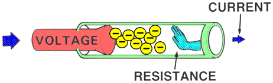

# 6. Magnitudes fundamentales eléctricas

{ align=right width=50% }

Cuando analizamos un circuito eléctrico es necesario conocer tres características importantes del mismo. Estas características se llaman **magnitudes  fundamentales eléctricas** y son:

- Voltaje o Tensión eléctrica $(V)$
- Resistencia eléctrica $(R)$
- Intensidad de corriente $(I)$

En la figura se ven reflejados estos tres conceptos. Es un circuito elemental al cual se le conectó un receptor (lámpara). La corriente llega gracias a un conductor eléctrico (cable).

## 6.1. Voltaje o Tensión eléctrica $(V)$

!!! Abstract "Voltaje"
    { align=right width=25% }
    El **voltaje $(V)$,** también llamado **tensión**, es como una *fuerza* que empuja a los electrones para que se muevan a través de un circuito.

Sin esta fuerza, los electrones no pueden desplazarse en la misma dirección y, por lo tanto, no hay corriente eléctrica. Por otro lado, hay que decir que **si aumentamos el voltaje de un circuito**, entonces, **el número de electrones en movimiento también aumentará**. 

Estableciendo un símil, si dejamos caer coches de juguete por una rampa, cuanta más altura tenga más fácil les será deslizarse y, por lo tanto, más coches podrán bajar por ella; de la misma manera cuanta más tensión tenga un circuito, más cargas eléctricas (electrones) circularán.

{ align=right width=20% }

Para medir el voltaje en una parte del circuito se utiliza un aparato llamado **voltímetro**, que se ha de conectar en paralelo con el circuito.

La unidad de medida del Voltaje ($V$) es el **voltio** ($v$). Por ejemplo:

$$V = 4\; v$$

## 6.2. Resistencia eléctrica $(R)$

!!! Abstract "Resistencia eléctrica"
    { align=right width=30% }
    La **Resistencia eléctrica $(R)$** es la *oposición* o *dificultad* que ofrecen los diferentes materiales al paso de la corriente eléctrica.

{ align=right width=30% }

Expliquemos la Resistencia eléctrica con un símil. Los coches en la carretera "representan" a los electrones que circulan por circuito. En la parte superior de la imagen, la carretera se **estrecha**, lo que dificulta el avance de los coches y genera "atascos". Esto es similar a lo que sucede en un material con **alta resistencia eléctrica**, donde el flujo de electrones se encuentra con obstáculos, dificultando su movimiento y perdiendo parte de la energía en forma de calor.

En la parte inferior, la carretera es más **ancha** y los coches circulan sin problemas. Esto se parece a un material con **baja resistencia eléctrica**, donde los electrones fluyen fácilmente, como ocurre en buenos conductores como el cobre. Cuanto más amplio y adecuado sea el camino, más eficiente será el transporte de los electrones.

En resumen, **la resistencia eléctrica mide lo difícil que es para los electrones moverse por un material**. En un circuito, usar materiales con baja resistencia es como conducir por una carretera despejada, mientras que materiales con alta resistencia dificultan el flujo, como un atasco en una carretera estrecha.

Así:

* cuanta **más resistencia eléctrica** tenga un material (como el plástico),  **menos número de electrones** en movimiento habrá,

* cuanta **menos resistencia eléctrica** tenga un  material (como los metales), **más número de electrones** en movimiento habrá. 

{ align=right width=30% }

La resistencia que ofrece un cuerpo se puede determinar con un aparato llamado **óhmetro**. Para esto, hay que desconectar el elemento que se quiere medir.

Su unidad de medida es el **ohmio** $(\Omega)$. Si los valores de la resistencia son grandes, se emplean múltiplos como el kiloOhmio $(k\Omega)$.

$$
1\: k\Omega = 1000\:  \Omega
$$

!!! example "Experimenta"
    { align=right width=40% }
    Si se toma un cilindro de hierro y un cilindro de cobre de idénticas medidas, y se mide su resistencia con un óhmetro, comprobaremos que sus valores son diferentes (el cobre ofrece menos resistencia).
    
    Asimismo, si cogemos dos trozos de cobre de diferentes dimensiones, comprobaremos que tienen resistencias diferentes.
    La resistencia eléctrica que presentan los materiales depende tres factores:

    * de la **naturaleza** del material (hierro, cobre, plástico, madera,...)
    * de las **dimensiones**:
        * longitud
        * sección.

## 6.3. Intensidad de Corriente $(I)$

!!! abstract " Intensidad de corriente"
    { align=right width=40% }
    La **Intensidad de corriente $(I)$** se define como el número de *cargas eléctricas negativas* (electrones) que atraviesan la sección de un conductor en la *unidad de tiempo* (en 1 segundo).
    

{ align=right width=50% }

Para entender esta definición vamos a establecer otro símil. Imagina que los coches que circulan por una carretera son los electrones o cargas eléctricas y la carretera es el cable conductor. Cuanta más intensidad de tráfico haya, más coches circularán en un determinado tiempo; del mismo modo, cuanta más intensidad de corriente tengamos en un circuito, más electrones se encontrarán circulando.

La unidad de medida de la Intensidad de Corriente es el Amperio (A). Cuando los valores de la intensidad son pequeños es más útil usar submúltiplos como el miliAmperio (mA).

$$
1\:A = 1000 \:mA
$$

La Intensidad de Corriente se mide con un aparato llamado **amperímetro**. Éste se conecta en serie con los otros componentes del circuito, para que la corriente pase a través de él.

## ¿Cómo afectan la $V$ y $R$ a $I$?

{ align=right width=30% }

* **$V$** es *directamente proporcional* a **$I$**:

    * Si **aumenta la $V$** de un circuito, entonces, el número de electrones en movimiento que pasan por un punto del circuito durante 1 segundo, aumenta. Entonces, **aumentará la $I$**.

    * De ello se deduce, que si **disminuye la $V$**, **disminuirá la $I$**.

* **$R$** es *inversamente proporcional* a **$I$**

    * Si **aumenta la $R$** de un circuito, entonces, el número de electrones en movimiento que pasan por un punto del circuito durante 1 segundo, **disminuye**. Entonces, **disminuirá la $I$**.
    * De ello se deduce, que si **disminuye la $R$**, **aumentará la $I$**.

