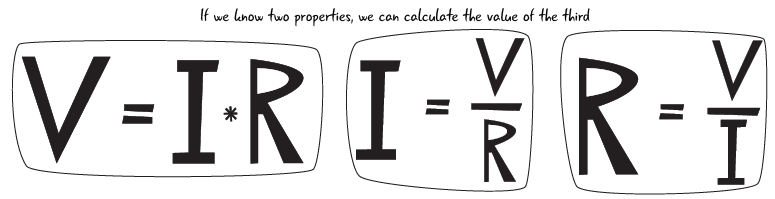
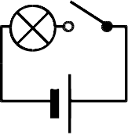

# 7. Ley de Ohm

{ align=right width=20% }

A comienzos del siglo XIX, el físico alemán George Simon Ohm estudió la **relación entre las magnitudes eléctricas básicas** ($V, I$ y $R$), justo como lo has visto al final del apartado anterior.

Comprobó que:

- al aumentar el **Voltaje** en un circuito eléctrico, también aumentaba el número de electrones en movimiento, es decir, aumentaba la **Intensidad de corriente**,

- que al aumentar la **Resistencia eléctica** entonces la **Intensidad de corriente** disminuía.

Fruto de esta experimentación, en 1827 enunció lo que conocemos como **Ley de Ohm**, que dice:

!!! info "Ley de Ohm"
La **Intensidad de corriente** ($I$) que circula por un circuito es directamente proporcional al **Voltaje** ($V$) aplicado e inversamente proporcional a la **Resistencia eléctrica** ($R$) del circuito.

La **Ley de Ohm** se puede formalizar mediante la expresión matemática siguiente:

$$
\large
I = \frac{V}{R}
$$

donde:

- $I$ es la **Intensidad de Corriente**, expresada en amperios $A$
- $V$ es el **Voltaje o Tensión**, expresado en voltios $v$
- $R$ es la **Resistencia Eléctrica**, expresada en ohmios $\varOmega$

Ahora trata de buscar la expresión de la Ley de Ohm pero con la $V$ y la $R$ despejadas:

- con el Voltaje despejado:

$$
\large
V = I \times R
$$

- con la Resistencia eléctrica despejada:

$$
\large
R = \frac{V}{I}
$$

{ align=center width=100% }

**Ejercicio**: Un circuito simple está formado por una pila de $9v$ y una bombilla cuya Resistencia Eléctrica es de $3\varOmega$.

a) Dibuja el esquema del circuito.

b) Calcula la Intensidad que circulará por el circuito.

**Solución**:

Datos:

$V = 9v$

$R = 3\varOmega$

a) Esquema eléctrico:

 { align=center width=20% }

b) Según la Ley de Ohm:

$$
\large
I = \frac{V}{R}
$$

sustituyendo:

$$
\large
I = \dfrac{9 v}{3 \varOmega}= 3A
$$
