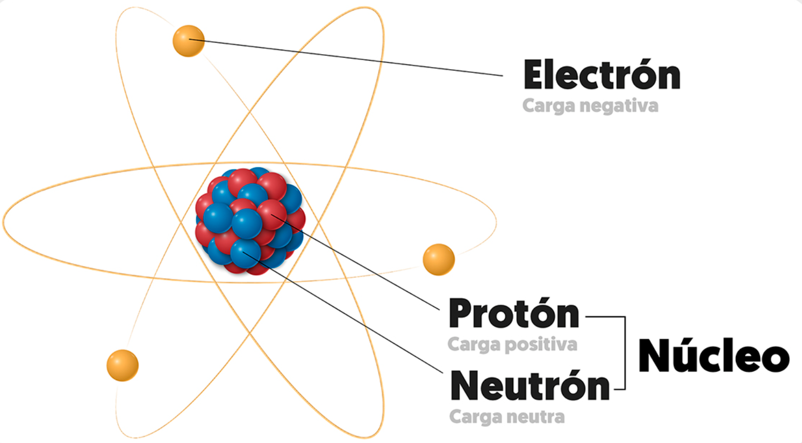
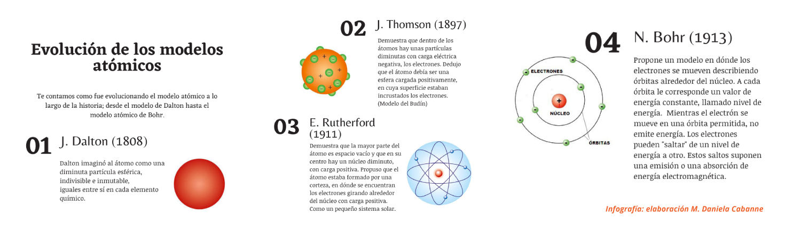
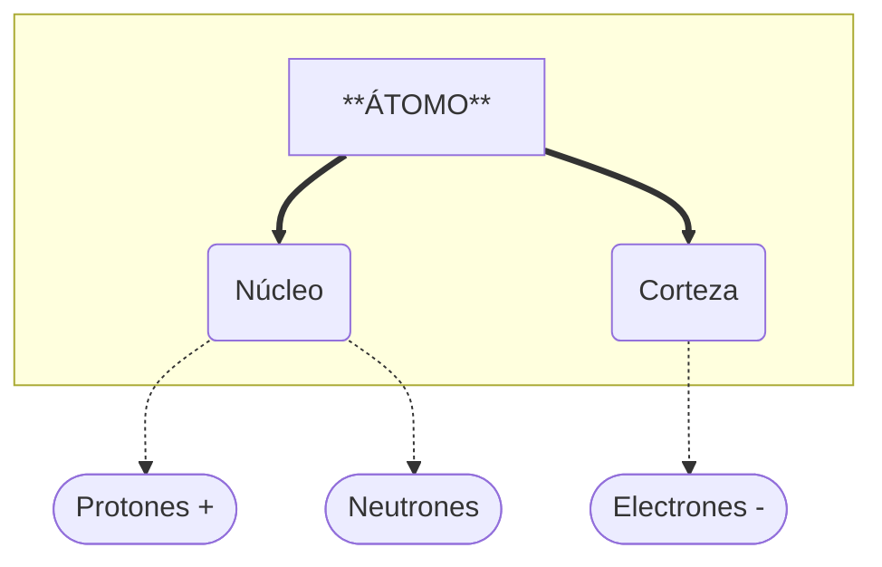
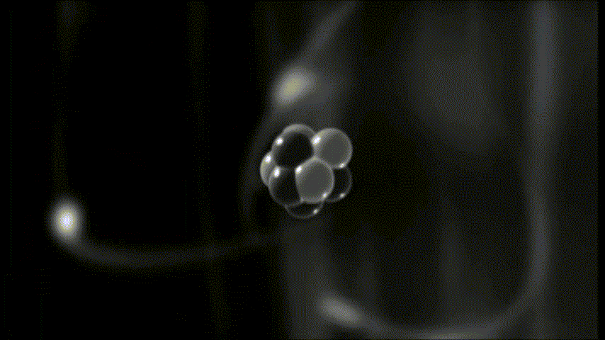
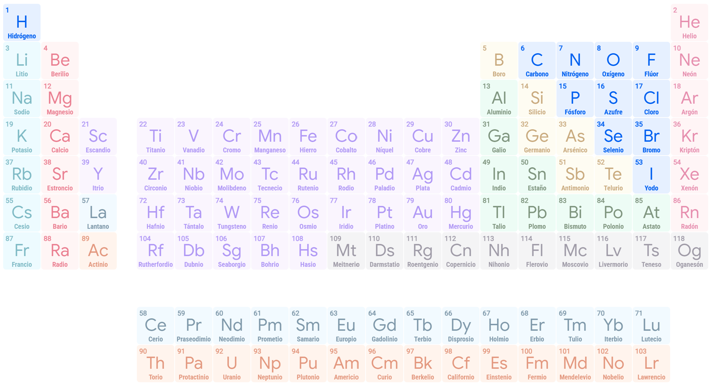

# 2. El átomo

## Definición de átomo

{ align=right width=45% }

Imagina que tienes una hoja de papel y la cortas por la mitad, y luego otra vez, y otra vez... llegaría un momento en que tendrías un trocito tan pequeño que ya no podrías cortarlo más. Ese "trocito" final es el ==**átomo**==.

El átomo es la pieza de construcción de todo el universo: desde tu móvil hasta el aire que respiras o las estrellas.

Los fenómenos eléctricos tiene su origen en la **estructura interna de la materia**, que está formada por partículas diminutas llamadas **átomos**, como hemos visto :simple-electron:. 

!!! note "Definición de Átomo"
    El **átomo** es el componente fundamental de la materia, y proporciona sus propiedades.

El átomo proporciona las **propiedades** a la materia significa que todo lo que percibimos de una sustancia (su color, dureza, conductividad, punto de fusión, reactividad química, etc.) viene determinado por la estructura de sus átomos y cómo estos se relacionan entre sí.

## Modelos del átomo

La palabra **átomo** viene del griego *a-tomos*, que significa **"indivisible"**. Antiguamente se pensaba que eran las piezas más pequeñas posibles y que no se podían romper.

No podemos ver los átomos a simple vista, pero gracias a la ciencia y la tecnología, hemos podido descubrir que el átomo es mucho más complejo de lo que se pensaba. Se han hecho miles de experimentos para tratar de descubrir cómo son. Los hemos irradiado con rayos de todo tipo, los hemos hecho chocar unos contra otros, pero a lo máximo que hemos llegado es a "hacernos una idea" aproximada de su estructura interna. Estas "ideas" de cómo son se llaman **modelos atómicos**.

En función de los experimentos realizados, se han propuesto diferentes modelos para explicar cómo es el átomo. Cada modelo ha sido una mejora del anterior, y aunque ninguno es perfecto, nos han ayudado a entender mejor la naturaleza de la materia y la electricidad.

*¡Atención! No es necesario que memorices los nombres de los modelos, ni sus autores, ni las fechas. Lo importante es entender que el átomo es una estructura compleja y que los científicos han desarrollado diferentes modelos para tratar de explicarlo. Cada modelo es como una "foto" del átomo, pero ninguna es la "foto definitiva".*

## Estructura del átomo

Aunque el átomo es la unidad básica de la materia, en la actualidad, se cree que son como un pequeño rompecabezas formados por **dos zonas** (núcleo y corteza) y **tres prtículas subatómicas** principales (protones, neutrones y electrones).

### ¿Cómo se organizan estas partes?

{ align=right width=30% }

==**NÚCLEO:**==  Es el "corazón" del átomo, la **zona más interna**. Es increíblemente **denso**, por lo general, el 99% del peso total de un átomo se encuentra concentrado en el núcleo. 

Aquí se encuentran dos tipos de partículas subatómicas: 

  - **Protones ($p^+$):**  Dan identidad al átomo (como su DNI).

  - **Neutrones ($n$):**  Actúan como "pegamento" para que los protones no se separen.  

==**CORTEZA:**==  Es el espacio gigante que rodea al núcleo.  

  Aquí se encuentra un tipo de partícula subatómica:

  - **Electrones ($e^-$):**  Giran a una velocidad increíble, creando una especie de "nube". Son los que pueden saltar de un átomo a otro, creando la **corriente eléctrica**.

Vamos a estudiar con atención las partículas subatómicas constituyentes del átomo y la facultad de moverse que tienen los electrones.

## Número atómico (Z)

Ahora vamos a descubrir qué es eso del **número atómico**. Cada átomo tiene una identidad secreta, como un DNI. Pues bien, ese "DNI" es precisamente el **número atómico**.

{ align=right width=20% }

!!! note "Definición de Número Atómico (Z)"
    El **número atómico** (que los científicos escriben con la letra **Z**) es el ==número de **PROTONES**== que hay dentro del núcleo.

*   **Es la identidad del átomo:** Lo que hace que un átomo sea de **cobre** es simplemente el número de protones (Z = **29**) que tiene en su núcleo, y no de **platino** que tiene **78**.
  
    *   **Importante:** Si un átomo tiene 29 protones, siempre será Cobre. No puede ganar ni perder protones.

Tabla periódica de los elementos
 [Haz clic aquí para ampliar](https://artsexperiments.withgoogle.com/periodic-table/?exp=true&lang=es)
