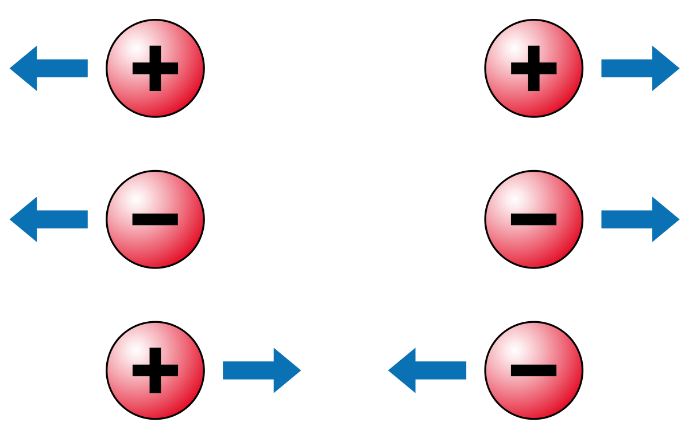
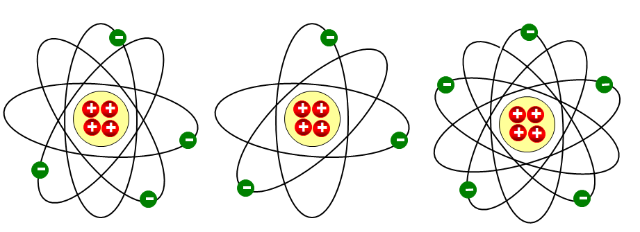

# 3. Comportamiento de las partículas subatómicas

## Fuerzas de atracción y repulsión

{ align=right width=30% } 

Entre las **partículas subatómicas** (como protones, electrones y neutrones)  existen **fuerzas de atracción y repulsión**, y son las responsables de mantener un átomo unido. De manera sencilla se puede decir que:

!!!note "Atracción y repulsión"
    * Dos cargas (o partículas) del **mismo signo** se **repelen**. 
    * Dos cargas (o partículas) de **diferente signo** se **atraen**.

Por esto último, podemos decir que:

* **Protones (+) y protones (+)**:

    * Se repelen porque tienen la misma carga positiva.
  
        * Sin embargo, dentro del núcleo, esta repulsión es superada por otra fuerza (nuclear) que hace que los protones no se separen demasiado.

* **Electrones (-) y electrones (-)**:

    * También se repelen porque tienen la misma carga negativa.

* **Protones (+) y electrones (-)**:

    * Se atraen porque tienen cargas opuestas.

      * Esto mantiene a los electrones girando alrededor del núcleo del átomo, como si fueran atados a él.

## Átomo neutro e iones

En estado normal cada átomo tiene el **mismo número de protones que de electrones**, por lo que, en este estado normal, se dice que es un **átomo neutro**.

Algunos átomos presentan tendencia a capturar o a perder electrones, lo que produce un desequilibrio de cargas.

- Si un átomo captura electrones queda cargado negativamente (**ión negativo**).
- En cambio, si pierde electrones, queda cargado positivamente (**ión positivo**).

Átomo neutro, ión positivo e ión negativo

Este fenómeno de pérdida o ganancia de electrones es fundamental para entender muchos fenómenos eléctricos, como la electricidad estática o la conducción eléctrica en los materiales.