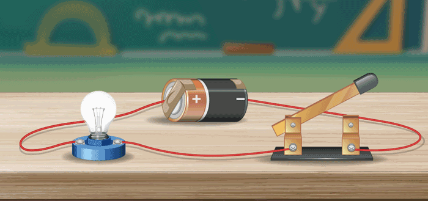

#5. El circuito eléctrico 

{ align=right width=300px }

Imagina que el movimiento de los electrones anteriores pudiera continuar. Esto lo puede conseguir una pila que "empuja" a los electrones a través de un cable conductor hasta hacerlos llegar, por ejemplo, a una bombilla. Para ello, es imprescindible que el circuito esté cerrado.

Al cerrar el circuito con el interruptor, los **electrones se mueven desde el polo negativo al positivo**, generando corriente eléctrica

Por tanto, para que se produzca corriente eléctrica hace falta:

- Una fuerza o energía que mueva los electrones (esta fuerza la posee la pila).
- Un material conductor por el que circulen los electrones.
- Que el circuito esté cerrado.

Entonces ya podemos definir lo que es un circuito eléctrico:

!!! note "Definición de Circuito Eléctrico 💡"
    Un **circuito eléctrico** se puede definir de dos formas:
    
    * un **camino cerrado** por el que circulan los electrones.
    * un conjunto de **componentes eléctricos** conectados entre sí, por los que circulan los electrones.

Este circuito eléctrico está formado por un **conjunto de componentes** conectados entre sí (pilas, interruptores, bombillas…)

!!! info "Sentido de movimiento"
    Al conectar los cables a la pila, los electrones salen del polo negativo de la pila y se mueven hacia el polo positivo, atravesando la bombilla en su camino. Los electrones vuelven a entrar en la pila cargándose de la energía necesaria para volver a recorrer el circuito eléctrico.