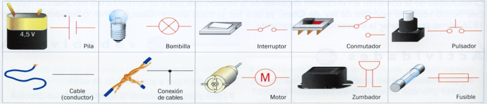
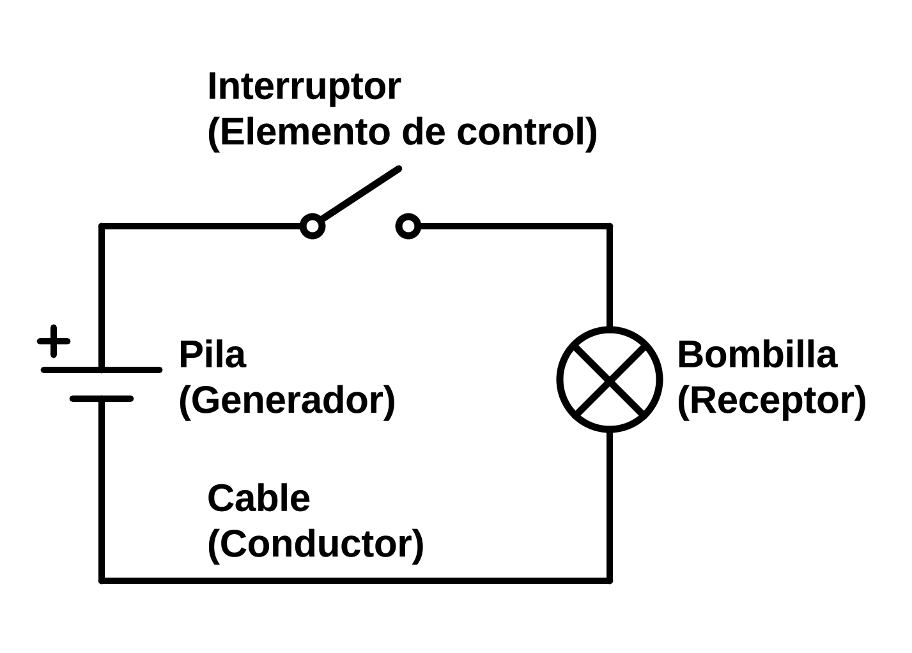
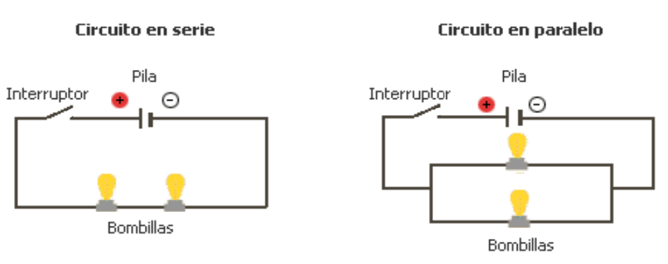

# 7. Símbolos y esquemas eléctricos

## Símbolos eléctricos

Cuando queremos representar un circuito eléctrico en papel nos resultaría muy complicado dibujar cada componente eléctrico con su forma real. Para solucionar este problema y representar el circuito más rápida y fácilmente, cada componente eléctrico se representa por su **símbolo eléctrico** correspondiente.

Hay un símbolo por cada componente eléctrico correspondiente. Estos son los más importantes:

{ align=center width=100% }

## Esquemas eléctricos

Una vez conocidos los símbolos eléctricos por separado podremos representar un circuito eléctrico con ellos. Esta representación sencilla del circuito se denomina **esquema eléctrico**

**Ejemplo**: Circuito formado por una pila, una bombilla y un interruptor.

{ align=center width=50% }

### Circuitos en serie y en paralelo

Los circuitos eléctricos pueden estar formados por varios componentes eléctricos. Según cómo estén conectados estos componentes, los circuitos pueden ser de dos tipos:

1. **Circuitos en serie**: Los componentes están **conectados uno tras otro**, formando **una única trayectoria** para la corriente eléctrica. Si se abre un interruptor o se funde una bombilla, todo el circuito se interrumpe y deja de funcionar.
  
2. **Circuitos en paralelo**: Los componentes están **conectados en varias ramas o caminos**. Si se abre un interruptor o se funde una bombilla en una rama, las demás ramas siguen funcionando normalmente.
  º
3. **Circuitos mixtos**: Combinan elementos de circuitos en serie y en paralelo. Algunas partes del circuito están conectadas en serie, mientras que otras están conectadas en paralelo.

{ align=center width=100% }