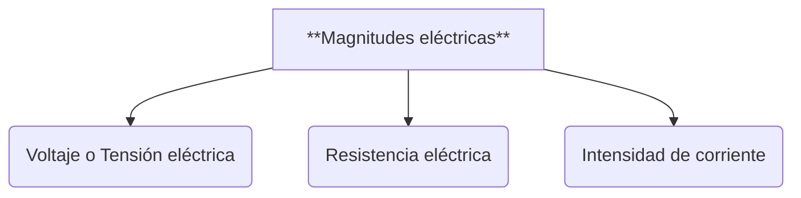
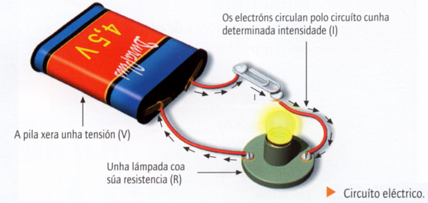
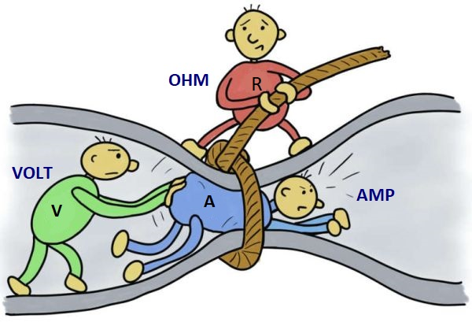
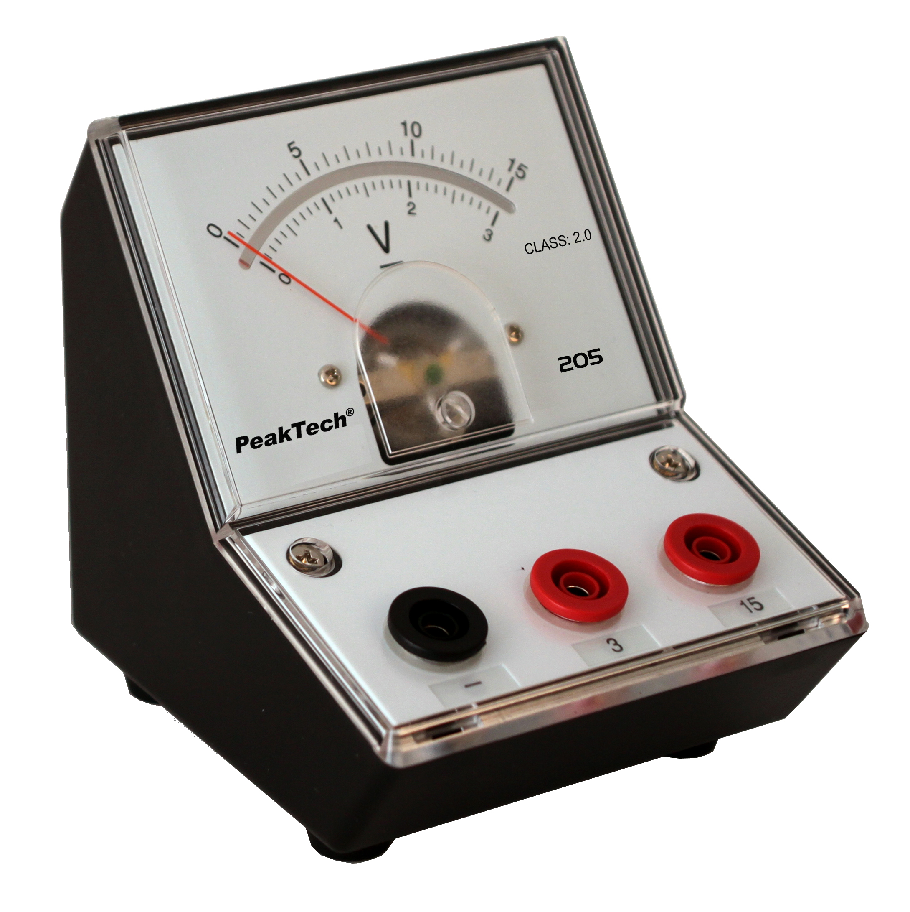
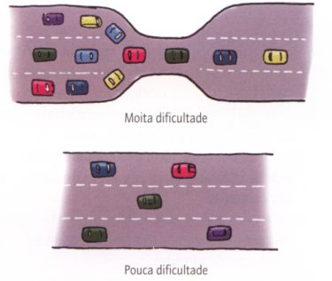
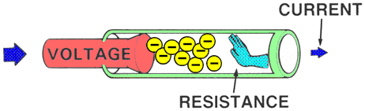
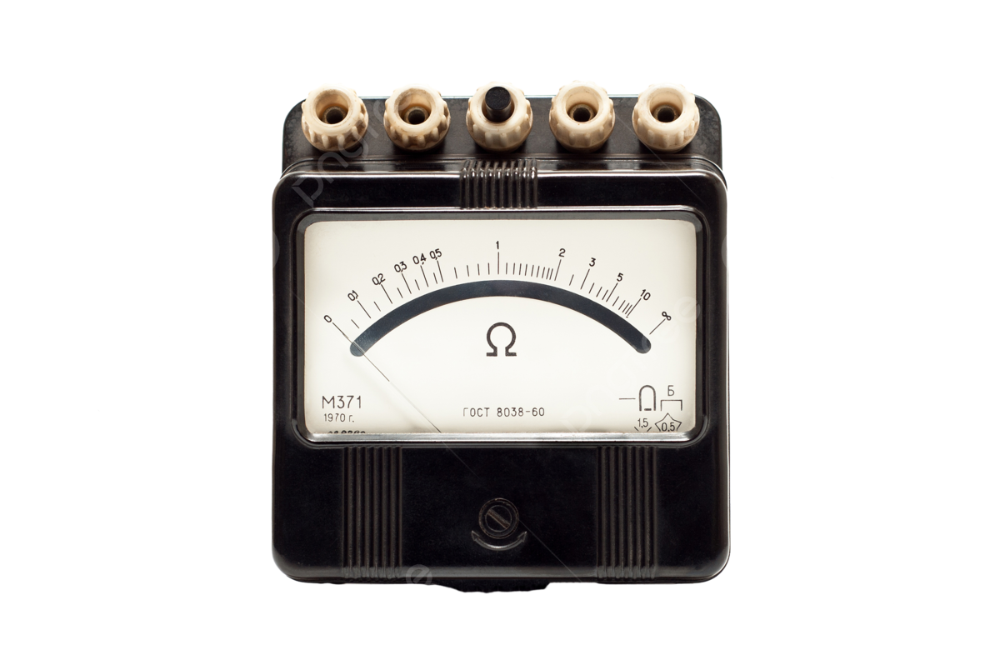
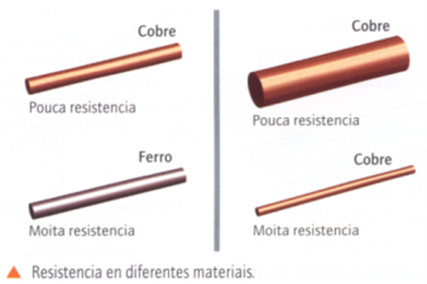
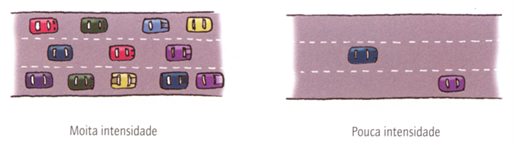

# 8. Magnitudes fundamentales eléctricas

Cuando analizamos un circuito eléctrico es necesario conocer tres **valores** importantes del mismo. Estas características se llaman **magnitudes  fundamentales eléctricas** y son:

{ align=right width=30% }

En la figura se ven reflejados estos tres conceptos. Es un circuito elemental al cual se le conectó un receptor (lámpara) que tiene **Resistencia eléctrica**. Debido al **Voltaje eléctrico** producido por la pila, la corriente (**Intensidad de corriente**) llega gracias a un conductor eléctrico (cable).

## Voltaje o Tensión eléctrica $(V)$

!!! Abstract "Definición de Voltaje"
    El **voltaje $(V)$,** también llamado **tensión**, es como una *fuerza* que empuja a los electrones para que se muevan a través de un circuito.

Sin esta fuerza, los electrones no pueden desplazarse en la misma dirección y, por lo tanto, no hay corriente eléctrica. 

{ align=right width=30% }

* **Si aumentamos el voltaje de un circuito**, los electrones se moverán con más facilidad y **circulará más corriente**.
* **Si disminuimos el voltaje**, a los electrones les costará más moverse y **circulará menos corriente**.

Para entenderlo mejor, podemos usar un ejemplo:

> Imagina coches de juguete bajando por una rampa:  
> Cuanto más alta es la rampa, más fácil es que los coches bajen.  
> De la misma manera, cuanto mayor es el voltaje, más fácil es que los electrones se muevan por el circuito.

{ align=right width=20% }

Para medir el voltaje en una parte del circuito se utiliza un aparato llamado **voltímetro**, que se ha de conectar en paralelo con el circuito.

La unidad de medida del Voltaje ($V$) es el **voltio** ($v$). Por ejemplo:

$$V = 4\; v$$

## Resistencia eléctrica $(R)$

!!! Abstract "Resistencia eléctrica"
    La **Resistencia eléctrica $(R)$** es la *oposición* o *dificultad* que ofrecen los diferentes materiales al paso de la corriente eléctrica.

Para entenderlo mejor, podemos usar un ejemplo:

{ align=right width=40% }

> Los coches en la carretera "representan" a los electrones que circulan por circuito:
> En la parte superior de la imagen, la carretera se **estrecha**, lo que dificulta el avance de los coches y genera "atascos". Esto es similar a lo que sucede en un material con **alta resistencia eléctrica**, donde el flujo de electrones se encuentra con obstáculos, dificultando su movimiento y perdiendo parte de la energía en forma de calor.  
> En la parte inferior, la carretera es más **ancha** y los coches circulan sin problemas. Esto se parece a un material con **baja resistencia eléctrica**, donde los electrones fluyen fácilmente, como ocurre en buenos conductores como el cobre. Cuanto más amplio y adecuado sea el camino, más eficiente será el transporte de los electrones.

En resumen, **la resistencia eléctrica mide lo difícil que es para los electrones moverse por un material**. En un circuito, usar materiales con baja resistencia es como conducir por una carretera despejada, mientras que materiales con alta resistencia dificultan el flujo, como un atasco en una carretera estrecha.

Así:
    { align=right width=30% }

* cuanta **más resistencia eléctrica** tenga un material (como el plástico),  **menos número de electrones** en movimiento habrá,  
  
* cuanta **menos resistencia eléctrica** tenga un  material (como los metales), **más número de electrones** en movimiento habrá. 

{ align=right width=30% }

La resistencia que ofrece un cuerpo se puede determinar con un aparato llamado **óhmetro**. Para esto, hay que desconectar el elemento que se quiere medir.

Su unidad de medida es el **ohmio** $(\Omega)$. Si los valores de la resistencia son grandes, se emplean múltiplos como el kiloOhmio $(k\Omega)$.

$$
1\: k\Omega = 1000\:  \Omega
$$

!!! example "Experimenta"
    { align=right width=40% }
    Si se toma un cilindro de hierro y un cilindro de cobre de idénticas medidas, y se mide su resistencia con un óhmetro, comprobaremos que sus valores son diferentes (el cobre ofrece menos resistencia).
    
    Asimismo, si cogemos dos trozos de cobre de diferentes dimensiones, comprobaremos que tienen resistencias diferentes.
    La resistencia eléctrica que presentan los materiales depende tres factores:

    * de la **naturaleza** del material (hierro, cobre, plástico, madera,...)
    * de las **dimensiones**:
        * longitud
        * sección.

## Intensidad de Corriente $(I)$

!!! abstract " Intensidad de corriente"
    { align=right width=40% }
    La **Intensidad de corriente $(I)$** se define como el **número** de **electrones** (*cargas eléctricas negativas*) que atraviesan la sección de un punto del circuito en la *unidad de tiempo* (en **1 segundo**).

    $$I = \frac{electrones}{segundo}$$
    

{ align=right width=50% }

Para entender esta definición vamos a establecer otro símil. Imagina que los coches que circulan por una carretera son los electrones o cargas eléctricas y la carretera es el cable conductor. Cuanta más intensidad de tráfico haya, más coches circularán en un determinado tiempo; del mismo modo, cuanta más intensidad de corriente tengamos en un circuito, más electrones se encontrarán circulando.

La unidad de medida de la Intensidad de Corriente es el **Amperio** (A). Cuando los valores de la intensidad son pequeños es más útil usar submúltiplos como el miliAmperio (mA).

$$
1\:A = 1000 \:mA
$$

La Intensidad de Corriente se mide con un aparato llamado **amperímetro**. Éste se conecta en serie con los otros componentes del circuito, para que la corriente pase a través de él.

## ¿Cómo afectan la $V$ y $R$ a $I$?

{ align=right width=30% }

¿Cómo podemos hacer para que una **bombilla brille más o menos**? ¿Cómo podemos hacer para que un **motor gire más rápido o más lento**?

>La respuesta está en controlar la **Intensidad de corriente $(I)$** que circula por el circuito.

¿Y cómo podemos controlar la **Intensidad de corriente $(I)$**?:  
Como ya has podido comprobar, podemos controlar la **Intensidad de corriente $(I)$** en un circuito modificando dos magnitudes: el **Voltaje $(V)$** aplicado y la **Resistencia $(R)$** del circuito.

### 📈 Relación Voltaje ($V$) – Intensidad ($I$)

| Situación | Efecto en los electrones | Resultado en $I$ |
|-----------|--------------------------|----------------|
| **Aumenta $V$** | Más electrones pasan por un punto del circuito por segundo. | **Aumenta $I$** |
| **Disminuye $V$** | Menos electrones pasan por un punto del circuito por segundo. | **Disminuye $I$** |

!!!tip "Conclusión $V$-$I$"
     $V$ es directamente proporcional a $I$:  

### 📉 Relación Resistencia ($R$) – Intensidad ($I$)

| Situación | Efecto en los electrones | Resultado en $I$ |
|-----------|--------------------------|----------------|
| **Aumenta $R$** | Disminuye el flujo de electrones por segundo. | **Disminuye $I$** |
| **Disminuye $R$** | Aumenta el flujo de electrones por segundo. | **Aumenta $I$** |

!!! tip "Conclusión $R$-$I$"
    $R$ es inversamente proporcional a $I$:

## 🧩 Resumen visual

| Variable | Cambio | Efecto sobre I | Relación |
|----------|--------|----------------|----------|
| **V**    | ↑      | ↑              | Directa  |
| **V**    | ↓      | ↓              | Directa  |
| **R**    | ↑      | ↓              | Inversa  |
| **R**    | ↓      | ↑              | Inversa  |
