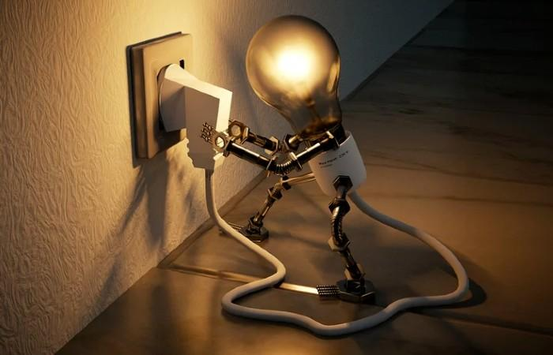

# **Electricidad básica** - 1º ESO

{ align=right width=30% }

¡Bienvenidos/as al curso de **Electricidad básica**! En este curso, aprenderemos los conceptos fundamentales que explican cómo funciona uno de los fenómenos más importantes y útiles de la naturaleza: **la electricidad**⚡. Este curso está diseñado para que comprendas los principios básicos que sustentan el funcionamiento de muchos dispositivos y tecnologías que usamos a diario.

[Versión PDF imprimible](pdf/document.pdf){ .md-button .md-button--primary }

==Si prefieres descargar el curso en formato PDF para **imprimirlo o consultarlo sin conexión**, haz clic en el botón azul de arriba.==

A lo largo del curso, exploraremos los siguientes temas:

-   :material-atom:{ .lg .middle } __El átomo__

    ---

    Descubriremos la estructura básica de la materia y cómo las partículas subatómicas, como los electrones, son esenciales para entender la electricidad.

    

-   :material-lightning-bolt-outline:{ .lg .middle } __La corriente eléctrica__

    ---

    Aprenderemos qué es el flujo de electrones y cómo se genera y se mide.

   

-   :material-generator-stationary:{ .lg .middle } __El circuito eléctrico__

    ---

    Estudiaremos las conexiones que permiten a la corriente eléctrica moverse y realizar trabajo útil.

    

-   :material-electric-switch:{ .lg .middle } __Símbolos y esquemas eléctricos__

    ---

    Aprenderemos a expresar gráficamente un circuito en un plano.

 

-   :material-omega:{ .lg .middle } __Magnitudes fundamentales eléctricas__

    ---

    Profundizaremos en el Voltaje, la Intensidad y la Resistencia eléctrica, comprendiendo cómo se definen, se calculan y se relacionan entre sí.

    

-   :material-calculator-variant-outline:{ .lg .middle } __Ley de Ohm__

    ---

    Analizaremos esta regla fundamental que relaciona el Voltaje, la Intensidad de corriente y la Resistencia eléctrica en un circuito eléctrico.

    

 

El objetivo de este curso es ayudarte a entender cómo funcionan los conceptos básicos de la electricidad y su importancia en nuestra vida cotidiana. Además, realizaremos experimentos prácticos para reforzar tu aprendizaje y despertar tu curiosidad científica.

¡Prepárate que despegamos! 🚀
